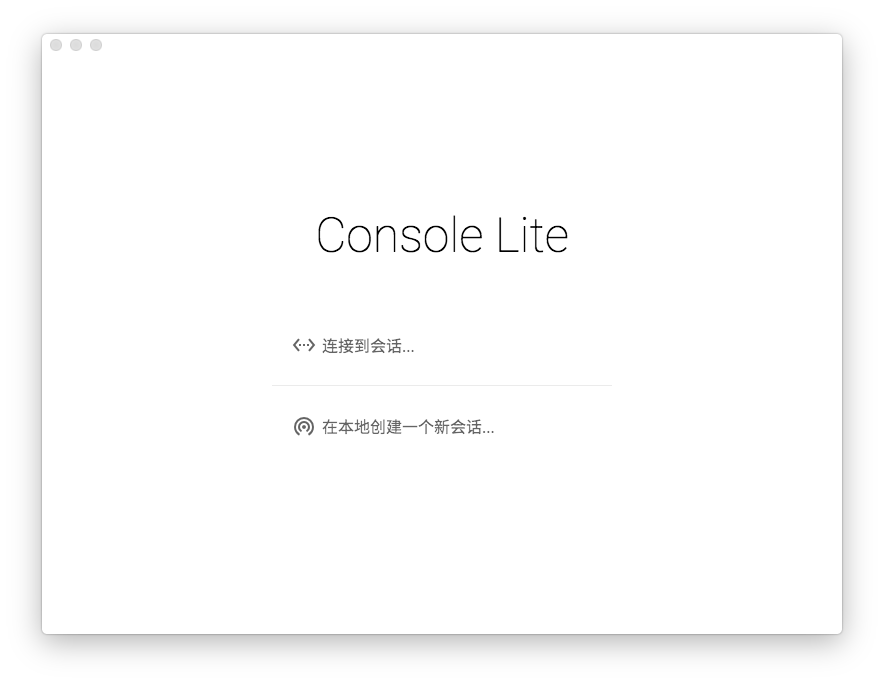

# Console Lite 使用手册 

Console Lite，/kˈɑnsoʊl/ /lˈaɪt/，翻译成中文是`控制台缩水版` (并不)，是一个模拟联合国会议软件。

Console Lite 拥有一下<small>十分厉害的</small>的功能：

- 支持多人协作，可以自动发现局域网内其他的实例并且连接
- 跨平台，支持 Mac OS X、Windows 以及大多数 Linux 发行版
- 拥有优雅的操作方法
- 占据震撼人心的硬盘空间 (例如：Windows 64位版本 300M)

## 下载

安装 Console Lite 十分简单，下载后开包即用。

当前发布的版本为 v1.0.1

  <a href="http://bjmun.org/console-lite/Console-Lite-v1.0.1-win32-x64.7z">
    <button class="down-btn primary">Windows 64位 (84.79MB)</button>
  </a>
  <a href="http://bjmun.org/console-lite/Console-Lite-v1.0.1-darwin.zip">
    <button class="down-btn primary">Mac OS X 64位 (140.35MB)</button>
  </a>

如果你的下载带宽不够，可以下载不带字体的版本，可能会导致体验弱化。

  <a href="http://bjmun.org/console-lite/Console-Lite-v1.0.1-win32-x64-nofont.7z">
    <button class="down-btn">Windows 64位 (46.4MB)</button>
  </a>
  <a href="http://bjmun.org/console-lite/Console-Lite-v1.0.1-darwin-nofont.zip">
    <button class="down-btn">Mac OS X 64位 (84.8MB)</button>
  </a>

启动 Console Lite 后，请继续阅读[起飞](takeoff.md)

## 开放源代码

Console Lite 的全部源代码在 MIT 协议下开放，源码在 [Github](https://github.com/CircuitCoder/Console-Lite) 上。


