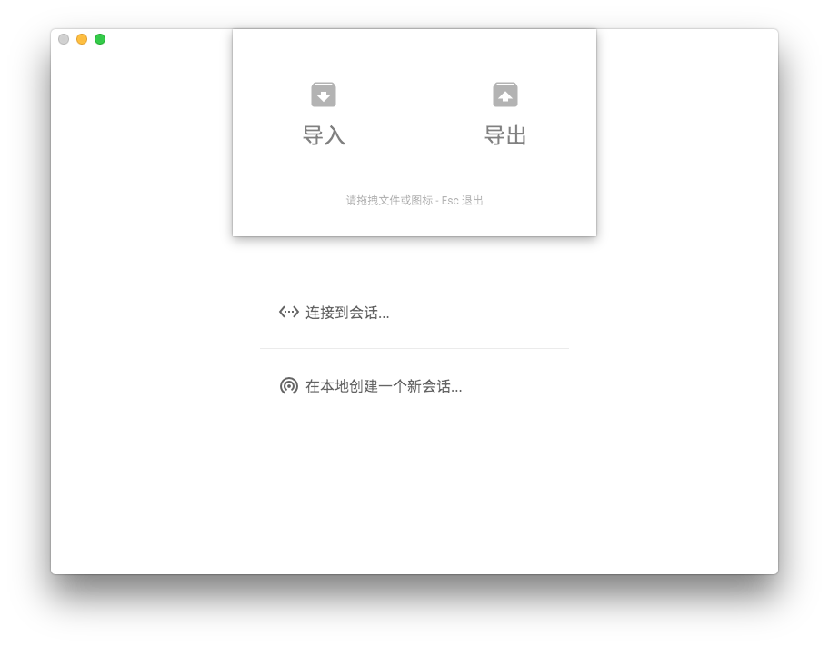

# 高级

这里有一些关于 Console Lite 高级话题的讨论。如果你希望对 Console Lite 进行扩展，请阅读[开发指南](developer.md)。

## 导出/导入/清除数据

在 1.0.4 及以上版本中，Console Lite 已经加入了数据导入导出功能。使用方法为：

1. 如果你的 Console Lite 正在运行一个本地会话，请先彻底退出 Console Lite，因为在数据库文件被占用时修改或复制可能会导致数据缺失或错误。这可能会导致其他连接的终端无法操作，请确保其他终端已经退出。
2. 在主页，点击菜单中 Edit > Import or Export Data，会显示如下图弹出窗口。
3. 在打开的窗口中，将导出图标拖出或者将之前导出的 `tar` 文件拖拽到导入图标上即可完成导入导出操作。



### 对于 =< 1.0.3 版本的说明

你可能已经发现，Console Lite 保存的数据是跟随软件一起移动的。如果你希望导出、导入或者清除数据，请直接复制、移动或者删除如下文件夹：

```
Console Lite 安装位置/Resources/app/server/backend/storage
```

如果你是 Mac OS X 用户，请右键 Console Lite.app，选择显示包内容(Show package contents)，进入 Contents 文件夹，随后跟随上述路径即可。

storage 文件夹内的内容与操作系统无关，所以跨平台转移数据是可行的。

## 启动 Headless 服务器

如果你希望启动一个无前端的服务器，请执行以下命令。

1. 从 [Github](https://github.com/CircuitCoder/Console-Lite) 下载项目源代码。使用 Git 或者下载压缩包均可。
2. 保证 Node.js 已经安装。
3. 在源代码目录下执行：

```
npm install --production
node server/main.js
```

即可看到被启动的服务器。

如果你希望使用 Electron 启动服务器，请跟随[开发指南](developer.md)中下载项目一节的指引，随后执行：

```
npm run server
```


