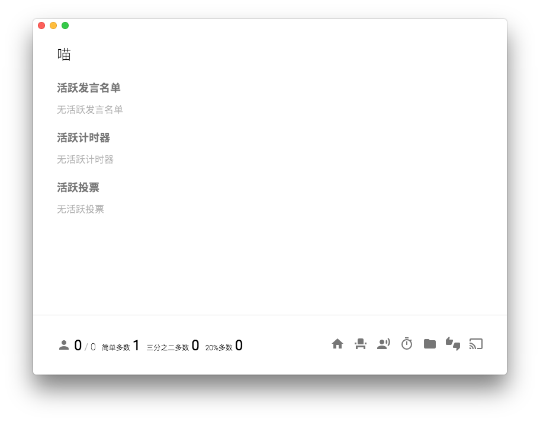
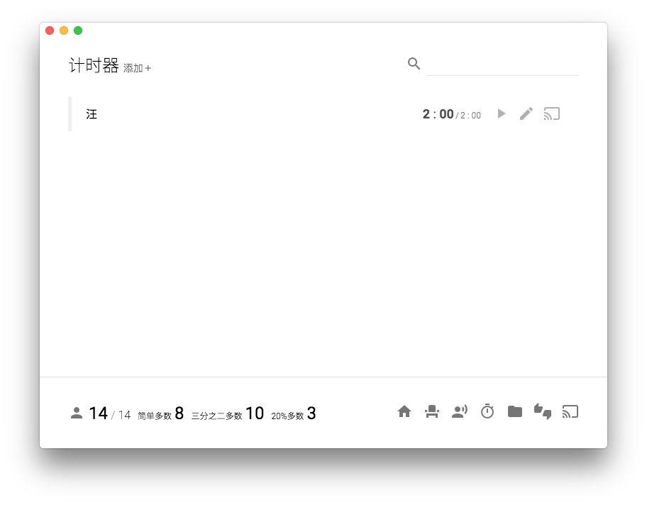

# 起飞

在这一章中，我们会介绍 Console Lite 的基本操作方法和设计理念。

## 真的起飞

启动 Console Lite 后，拖动窗口可以移动窗口位置。点击`在本地创建一个新会话...`，随后可以看到一个对话框:

点击对话框两侧的灰色背景可以关闭对话框。随后选择创建一个新委员会，可以看到一个新的创建委员会的对话框。填入委员会名，点击创建，随后点选刚刚创建的委员会，即可进入应用的主页。

下方左侧为委员会名称和出席状态，右侧的按钮从左到右依次的意义为：
- 席位
- 发言名单
- 计时器
- 文件
- 投票
- 打开／关闭投影窗口

除了最后一个关于投影窗口的图标，点击相应的图标可以前往其相应页面，同时，点击委员会名称可以回到主页。以计时器为例，点击秒表图标。

随后，在计时器页面，点击标题右侧的 添加+ 按钮，填写显示名和时间，点击提交，可以看到刚刚创建的计时器出现在列表中。

点击右侧的开始图标，可以启动计时器。点击编辑图标可以修改计时器的总时间。注意，修改计时器之后会重置其当前时间，最左面的按钮是用于将这个计时器投影到投影窗口上，我们将会稍后提到。

启动计时器后，可以注意到计时器显示出现了变化:

首先，最左侧的指示器变深，说明计时器正在运行。左侧的开始按钮变为暂停按钮，编辑按钮被禁用。这时候切换到主页，可以看到启动的计时器被显示到主页上:

最后，在计时器结束的时候，会有系统通知出现。

如果你已经打开了投影窗口，然后点击计时器最右侧的投影按钮，可以看到投影界面出现了这个计时器的信息。投影界面中的文字是随窗口宽度变化的，适配的 4:3 屏幕：

除此以外，其他的页面中都包含有相应的说明。如果你对设计理念不感兴趣，请接下来阅读 [操作](manipulate.md) 一节。

## 关于设计理念

在上面一段中，可以注意到，我们没有在对话框上单独的关闭按钮，这是因为 Console Lite 的一个设计理念：**删去或隐藏不必要的元素，凸显有效信息。**之后你也会看到大多数的按钮都被表现为图标形式，在列表界面没有表头和说明信息，只用颜色和字号字重标记信息，也是在遵循这个设计理念，也是 Console Lite 被叫做 Lite 的原因。这点显然会对软件的上手造成一定层面的影响，但是在熟练使用之后可以提高工作效率，是优是劣仁者见仁，我们只是希望将理念贯彻到极致。

同时，对话框也体现了 Console iT 的另一个设计理念：**操作一致性**。大多数的创建和修改操作，如果不能一步完成，都放置在一个单独的对话框中。对话框下方右侧按钮为主要行动按钮，没有关闭按钮，通过点击对话框外进行关闭或者取消操作，放到应用的任何一个部分都是正确的。这可以稍稍降低操作难度，主要是在开发层面上可以最大限度重用已经完成的工作。
