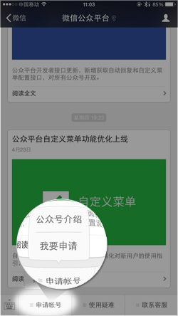

<style>
.smaller {
  font-size: .8em;
}

.smaller-next + * {
  font-size: .8em;
}

.emph {
  display: inline-block;
  background: rgba(0,0,0, .12);
}
</style>

# 北京模联组织团队工作指南

本篇之目的在于为第七届乃至以后北京市高中生模拟联合国协会组织团队工作提供参考，内容涉及：行政、学术、公关、会务、财务、技术以及本人尽可能可以考虑到的相关内容。如果顺利，本人在完成本篇后将不再更新任何内容，但阅读、使用者依旧可以完善，改进本篇之内容、结构。

许嘉昭二零一六年八月于北京。

- [ ] 行政
- [ ] 学术
- [ ] 公关
- [x] 会务
- [x] 财务
- [x] 技术
- [ ] 其他

> 这个不是你们看完点一下。。是我写完点一下。。！

## 概念
北京市高中生模拟联合国协会每年举办两次会议，北京市高中生模拟联合国大会与北京市高中生模拟联合国暑期研讨会，大会通常设置三中三英六个委员会，研讨会设置两中两英四个委员会（BJMUNSS 2016为三中两英五个委员会）。会议是协会活动的主要体现方式，除去会议之外，协会曾经举办过成员校大会（讨论北京地区模联之发展与协会之发展）、合作会议（BJMUN以学术、会务援助之方式参与到成员校的校内、校际会中）等。

北京模联（应）是北京地区高中生模联活动之表率，其学术、会务水平（应）为北京市内最高，会议筹备流程最为复杂。

## 行政

首先我们需要梳理下北京模联的组织架构（以2016年8月14日的版本为准）。

<table class="smaller">
  <tr><td colspan=8>协会</td></tr>
  <tr><td colspan=6>组织团队</td><td>成员</td><td>理事<sup>3</sup></td></tr>
  <tr><td colspan=6>秘书处</td><td>各个成员校</td><td>各个理事校</td></tr>
  <tr>
  <td>学术总监</td>
  <td>会务总监</td>
  <td colspan=2>技术总监</td>
  <td>财务总监</td>
  <td>艺术总监</td>
  </tr>
  <tr>
  <td>学术团队</td>
  <td>会务团队<sup>1</sup></td>
  <td>技术团队</td>
  <td>技术部</td>
  <td>个人</td>
  <td>艺术助理<sup>2</sup></td>
  </tr>
</table>

明确用词，组织团队是BJMUN唯一的决策机构，在对外使用的时候请尽量减少使用“组委”二字，毕竟理论上“组委”的全称是“组织委员会”，显得很官僚。

1. 会务团队

  如今，我们可以看到每次会议学术、技术都已经有一个团队在运作了，而会务总监依旧是身担数职，空挂总监职位，我个人（许嘉昭）在今年年初曾经构思过每次会议在筹备伊始招募一个十人以下的会务团队来完成会务工作，这样可以减轻会务总监的工作负担，同时可以为后一届北京模联组织团队会务总监人选储备人才。

  会务具体内容将在会务部分谈及。

2. 艺术助理

  单独招募一名在舞会培训和舞会主持工作上协助徐德尘的高一学生，毕竟并不清楚徐德尘是不是会在某次会议跳票，该人可以随时升为艺术总监。

3. 理事

  “理事”的职务和他（她）的名字是相应的，他（她）是有管理和参与权的，在BJMUN 2015 之前，所有学校都是“理事校”，然而他们并不能实际进行理事，所以我在2015年之后，参考联合国大会的称谓，所有的理事校都重新成为成员校，从而将理事这一概念消除。

  然而理事一职确实也有存在的必要，第四届秘书长汪维垚曾经提出人大附中、清华附中和北京二中需要逐渐退出组织团队，或者至少退出秘书处，秘书长要让更多的学校学生来担任，组织团队要尽可能吸纳更多学校的人才。从诸君第七届组织团队的人员设置相信大家已经看到了这一势头，然而实际上就是为了规避这么做所造成的风险，理事的存在也许成为了一种应对方法，由一定数量学校的秘书长来担任理事（甚至可以设置常任理事和非常任理事两个组别），来决定重要事务。

  如果这种制度推行，那么北京模联“协会”的特点将更加凸显。

以上的三个注释内容是我个人（许嘉昭）的设想，我已经意识到改变的困难，故仅作参考。

## 学术

**无论任何时候，学术都是一个模联组织所应该守护的一个标杆，代表之所以会报名北京模联，不是因为情怀，也不是因为会务，而是因为北京模联是全北京规模最大的高中生会议，这与之对应的就应当是北京地区学术水平最高的高中生模拟联合国会议。**

根据我本人（许嘉昭）和崔德方得出的共识，学术能力主要包括以下三方面：

- 学术知识储备
- 学术态度
- 学术学习能力

能看到本篇的诸位与后来人，相信你们在这三方面或多或少都有过人之处，但是还需要足够的驭人能力和沟通能力，在于会议主席的交流上会出现很多问题，相信诸位比我个人（许嘉昭）有更多的BJMUN主席经验，诸位也都了解我所说的是什么。

在学术部分，叙述会很理想化，请各位见谅。

### 模联人的坚守

诸位在学术准备、交代任务的时候，有一些原则应当遵守：

* 认真的工作态度（抄袭、糊弄是不应出现的，BJMUNSS 2016 学术团队存在严重的态度不端正情况）
* 准时的工作（几年来，学术总监布置的时间节点平均会被拖一周半以上）
* 质量第一（在数量和质量中选择的结果）

学术团队招募

学术团队是整个模拟联合国会议的主体部分，几十个人将决定会议的水平高低，在2015年之前学术团队招募会考虑到学校因素，也就是大家所熟知的“主席配额制”，但是在BJMUNSS 2016 的录取过程是可以称为绝对公平的，录取者确实都是“学术知识储备”最好的27位申请者。

依照BJMUNSS 2016 的学术团队申请者来看，BJMUNC 2017 将是学术团队申请者最多的一次会议，故在制定最早的时间轴时应注意不应拖得过晚，依照往年期中考试左右进行面试是肯定不可行的，学术总监应予以重视。

在往年的笔试题中，北京模联是没有学术问题的（比如针对某个事件进行详细分析，以此来评价申请者学术能力），第五届中文学术总监周润皓的观点是：“我们都是高中生，我们很难评估一个人说的是否对错，说不定是我们学术总监错了而申请者的观点是对的，这就很不好办”。

周润皓说的是有道理的，但是其实在笔试题中，我们首先可以看出的是一个人的“学术态度”和“学术学习能力”，比如在一个分析题上他回答的多少，回答的时候符合逻辑，能否把参考和引用列明。而最后所考察的才是学术知识储备，而学术知识储备大多也都是在面试的时候才会去认真考察的了。

在对学术团队进行录取时，“学术知识储备”、“学术态度”和“学术学习能力”三者头一个应该被考虑的应是“学术态度”，在BJMUNSS 2016 的筹备过程当中，相信你们也已经对某些（不点名）主席团成员的工作态度有所认识，他们或许曾经拿过北大会的大奖（本人许嘉昭一贯认为北大会的奖项含金量为零），但是在实际工作当中并没有展示出符合一个全国会议大奖获得者应有的态度。

“学术学习能力”是第二应当被考虑的，学术学习能力所指是一个个体在面临问题或者感到需要提升的时候，他（她）所能进步的速度。举几个例子，在“国际移徙与发展”这个议题下，主席团在做学术准备时，所参考和阅读的内容到底是联合国官方发布的国际移徙报告或者世界银行发布的国际移徙数据库，还是著名期刊、新闻，还是只能找到知网二三流论文。

举的例子很不恰当，但是大致解释了什么是学术学习能力，不怕一个人的水平不够，就怕一个人没有提升的空间。

“学术知识储备”是最后应当被考虑的一项，其实仔细思考便可发现，丰富的“学术知识储备”是一个模联人同时拥有端正的“学术态度”和优秀的“学术学习能力”的必然结果，想必不用多说。

关于学术团队招募的具体流程，我会单独介绍。

### 学术团队招募流程

发布学术团队招募令后，根据报名的提交方式来决定学术总监是否需要提前开始审核申请还是统一进行，笔试审核一般指挥筛去态度明显不端正的申请者，具体的学术考核还是需要交由面试来处理。

在笔试时，无需给出具体的分值。

面试需要选择一个时间地点，统一进行面试，时间轴信息已经放在了末尾，请参考。

面试结束当天便可以决定初步人选，之后再一周内结束所有补面试，后发布邮件，拉群。

### 学术团队分组

学术团队在确定人员之后，分组是最为重要的工作，由于BJMUN是先定主席人员，再定委员会与议题，所以每个委人员是否合适，主席是否会适应同事都是未知数。

同时由于不同主席的性格原因，在一个主席团工作组中，最终会形成一个类似DH的人物和一个协调官，其他是DM，所以学术总监需要根据自己对主席团成员的了解，合理分配人员。

男女分配同时需要被考虑。

## 财务

财务工作分为以下四部分

* 会计（年度预算与会议预算）
* 出纳（收入和支出）
* 审计（监督与财务报表）
* 赞助（寻求潜在资金来源）

### 会计

会计是对北京模联的资金运动进行全面、综合、连续、系统的核算与监督，由财务总监或负责财务的组织团队成员负责，向秘书长提供会计信息、参与北京模联经济管理、旨在提高北京模联经济效益的一种经济管理工作。

我们将一届组织团队的工作周期成为一个财年，在一个财年里，组织团队需要进行两次阶段性财务工作，不用解释大家都能明白是两次会议。组织团队的目的是在一个财年里保持盈利，简单来讲就是当每届组织团队8月份卸任的时候，不会给下一届组织团队留下财务负担，在这一点上，第四届和第六届组织团队就做的不是很好，年度亏损分别为12000元与3000元。相应的，阶段性财务工作并不需要保持一定盈利，当然如果可以做到盈利是最好的，按照规律来说，大会（BJMUNC）通常来讲是盈利会议，而研讨会（BJMUNSS）是亏损会议，前者为后者背书后算入整年度的财务工作中。

会计的最主要工作就是制定年度预算与会议预算，年度预算通常非常简略，因为它确实不能做得很详细；会议预算需要做得尽可能详细，其涵盖内容最多，是组织团队一个会议工作的根本（这里不与学术本位冲突，大家理解即可）。

预算的制定原则是计算所有可能的支出，并预计会议参会人数，并最终制定“会议费用”。

需要明确的是，会费并不是越便宜越好，具体并不想解释，但是一个更贵的会议费用会促使代表更认真的做会议准备，具体会费金额的制定是一个经济学和心理学的双重博弈，请慎重。

制定预算是需要考虑的支出项目包括但不限于：

* 活动场所租赁费（如舞厅、开闭幕式会场）
* 会场租赁费（每个委员会使用的会场）
* 工作人员住宿费（免除住宿费的人员有：全体组织团队成员、全体技术团队成员；减收住宿费的人员有：全体主席团成员、全体技术部成员、必要情况下的老司机）
* 设备购买、租赁费用（包括打印机、投影机、相机及镜头、路由器等）
* 代表用品印刷、购买费用（国家牌、代表牌、代表牌带、会议手册、意向条簿、笔、<div class="emph">证书与参会证明</div>[^1]、文件袋等）
* 志愿者用品费用（志愿者是不用缴纳会费的，所以志愿者除去住宿外的一切都是纯支出）
* 餐饮（BJMUN目前不存在为代表统一订饭的情况，未来也许有）
* 茶歇
* 纪念品制作费用
* 保险
* 技术团队补助（只有团队的成员有，如果都是新加入的技术部的人，那么就没有）
* 服务器续费、微信排版工具续费、各种会员续费、主题费用。
* 会议用品印刷、购买费用（一次性展架、一次性背板、收据簿、灯球、法槌、喇叭、插线板、网线、视频线、视频转接口、皮筋等，大多第六届组织团队都有剩余）
* 消耗品费用（胶条、剪刀、马克笔、硒鼓、打印纸、双面胶、药品、玫瑰）
* 可能存在的特殊纪念品（老司机牌，不过大概可能你们不会有这个问题了，因为你们基本上都不认识老司机了）
* 组织团队庆功宴（一般来讲是徐德尘请客，不过BJMUNC 2016 是刘一杉使用大会会费结的帐，庆功宴固然有存在必要，但是还需要适当适量）

一般来讲，将这些内容计算求和之后，直接除以预计代表人数便可得出人均收费，在适当上调至一个整数即可，但由于代表人数很难预计，预算工作同时又会受到诸多因素的影响，所以还需要看情况决定最终的会费。

预算范例

* 链接：http://pan.baidu.com/s/1c2uTlCG 密码：hwbv

在这份预算模板里是包括一些求和函数和求积函数的，请小心使用。

[^1]: 证书与参会证明是一类

### 出纳

出纳是按照组织团队规定（通告、预算等），办理北京模联的现金收付、银行结算及有关账务，报关库存现金、财务印章（你们可以去考虑刻一个，不过并不具备法律效益）及有关票据等工作的总称。

理论上来讲，会计和出纳不应该是一个人，但是北京模联难以做到一个多人的财务团队，所以其实还是由财务总监或者负责财务的组织团队成员来执行。

出纳说简单一点，就是资金的流入和流出，BJMUN的资金流出方式主要都列在上面会计部分了，流入方式主要包括：

* 代表缴纳会费（BJMUN 2015 使用的是银行卡转账，BJMUN 2016 加入了支付宝与微信转账[^2]）
* 代表缴纳住宿费
* 志愿者缴纳住宿费
* 主席、技术部成员、老司机缴纳住宿费（大多是再会议最后一天或者会后结算，因为通常会尽量给予优惠）
* 赞助商赞助

会计上账之后，出纳就需要按需走程序，打钱或者收钱。

[^2]: 不建议再使用微信进行资金流动，第一微信过于私人，第二微信提现需要收手续费。

### 审计

审计在财务工作中其实并不重，但是却是重要的一环，而且审计不应该再由财务总监负责，最好能够是秘书长亲自进行财务审计工作。

审计是指由专人依照法律和北京模联工作的原则对北京模联各个部门和个人的财务收支进行事前和事后的审查的独立性经济监督活动。

其实在完成审计的同时，就可以出一份**财务报告**，财务报告一事是我个人（许嘉昭）从2015年就希望可以做的事情，毕竟北京模联不存在营利，但是经济环境已经不再允许组织团队继续以如此低的会费（510元人民币）继续开办2017年的两场会议，一个令人信服的财务报告是提涨会费的可靠依据，同时可以向外证明BJMUN不存在任何组织团队拿钱的现象。

### 赞助

当前赞助方是“子期咨询 ”——BJMUN第一任秘书长朱正人和第二届正副秘书长孙宇童和刘奕创建的留学咨询公司。

子期咨询的约定是一年赞助两万人民币，分2月与9月两次到账，本次BJMUNSS 2016 由于亏损故9月的赞助将不能投入到BJMUN 2017的筹备当中，请诸位知悉。

寻找赞助有几项原则需要遵守：

* 赞助商对会议零干涉
* 绝不以代表信息作为交换筹码
* BJMUN永远不是商业会议

在以上几条原则的基础下，可以和赞助商谈进一步的合作，比如官网挂个广告，比如微信公众号挂广告，比如给代表发传单，比如印制赞助商的展架，比如在开闭幕式上给赞助商一个演讲或者互动环节（时间不宜过长），比如在会议手册中将贺信的内容交给赞助商来写等等。

一般来讲赞助商肯定会需要在背板上注明，故制作者还需要索要赞助商的矢量标志。

## 会务

会务是一场模联会议最为基础的部分，好的会务可以保障会议顺利开幕和平稳闭幕，首先我们梳理一下会务工作所涉及的内容。

* 会议场地相关（秘书长、总监亲自负责）
* 文书工作（秘书长、总监带领团队负责）
* 物料印刷、制作相关（团队负责）
* 参会人员联络（团队负责）
* 参会人员信息整理（总监带领团队负责）
* 采购与租赁（均可）
* 保险（总监亲自负责）
* 志愿者管理（总监带领团队负责）
* 注册、入住相关（团队负责）
* 餐饮（总监亲自负责）
* 会议期间人员管制（总监带领团队负责）
* 会议期间的会议保障（团队负责）
* 其他活动（团队负责）
* 茶歇（团队负责）
* 纪念品售卖（总监带领团队负责）
* 会后物资登记、封存（总监亲自负责）
* 失物招领（总监亲自负责）

会务工作是最恼人的工作，也是工作量最大的工种之一（和技术比肩）。并不是所有的工作都应当由会务总监亲自完成，也不是所有工作都可以下放给会务团队的成员完成，甚至有些内容需要秘书长亲自参与完成。

### 会议场地相关

北京模联已经在北京市二十一世纪饭店举办了7次会议，且二十一世纪饭店也表示有意向继续合作，按照酒店的意思是：你们寒假一来就开走我们二百多间房，冬天旅客又少，所以我们还是挺赚的。

虽然第七届组织团队也许并不需要担心酒店问题，但是事实上危机可能随时发生，同时由于二十一世纪饭店基础设施落后、地理位置过偏，更换会议场地是迟早的事情。故还需要就会议场地的寻找和谈判进行适当的解释。

场地挑选首先要考虑的因素：

* 酒店会场租赁费用合理（二十一世纪属于中等水平）
* 酒店地理位置适宜和交通发达（二十一世纪属于中下等水平）
* 基础设施健全（二十一世纪属于下等水平）
* 周边商铺环境丰富（二十一世纪属于上等水平）
* 餐饮水平
* 安全问题
* 会场、房间分布符合会议需求（二十一世纪属于上等水平）

万事钱当先，会产租赁费是财务工作中的大头，它的价格高低直接导致了会费的涨跌，同时影响了代表的参会欲望，虽然会费不是越便宜越好，但是会场租赁费绝对是越便宜越好，这样可以留给财务团队和会务团队更大的活动空间。

地理位置和交通发达不解释，提醒两点：距离公共交通站点越近，代表可能遇到的危险就越少；外卖受地理位置影响也很大。

基础设施是影响代表认为会议是否专业、舒适的直观因素，虽然我不想吐槽，但是二十一世纪的马桶、灯光、窗户是同星级酒店中较差的了，在会场和开闭幕式场地，音响、电源电压等都存在严重的问题。

周边商铺的作用是给代表提供良好的就餐、减压环境，尤其是BJMUNSS 2016 开始酒店不在提供自助餐餐券售卖，代表需要自行解决餐食问题，所以周边有商业中心是非常有利的，二十一世纪在蓝色港湾的旁边，是比较符合要求的。

如果酒店配备早餐、中餐和午餐，那是最好的，一般来讲餐饮费用不会计算在支出之中，但是如果算，财务工作便还需注意这一点。健康第一。

安全问题是最重要的，尤其是夜间，很多代表会选择夜间出行，所以周边要有长明路灯，同时组织团队要对周边道路充分了解。

会场和房间的分布是比较重要的一项，二十一世纪所有的会场都在一层，有利有弊，弊在于电梯的使用非常拥挤，利在于方便组织团队管理。IMUNC主会使用的友谊宾馆就是在这个问题上有很大的问题，会场分布在不同的楼和楼层，非常的麻烦。

### 文书工作

文书工作包括所有的通告和通知内容、会议手册内容。编写上述内容需要使用正式办公用语，表述尽可能正式。

所有的文书都可参考当前的通告内容和会议手册内容，我会单独开文档列出。

### 物料印刷、制作相关

物料包括所有印刷品、手工制品和订购制品，主要在于联系印刷厂印刷各种物料、联系淘宝店制作各种纪念品、手工准备各种物料。

BJMUNSS 2016 印刷店信息（服务不错）：

* QQ：649193852
* 地址：海淀黄庄路口西南靠北居民楼一层。

印刷要求（BJMUN 2016 版本，暑期研讨会不设观察员）：

<div class="smaller-next"></div>

|物料名称|数量|印刷尺寸|四周出血|纸张种类|颜色格式|备注|
|---|--|--|--|--|--|--|
|会议手册内页|#|B5竖版|各3毫米|印刷纸|CMKY|无光膜（类似磨砂）、骑马钉，参见上次会议|
|会议手册封面||||铜版纸或类似|||
|证书1参会证明|#|B5横版||300g铜版纸||光膜|
|证书2观察员|#||||||
|证书3志愿者证明|#||||||
|证书4荣誉证书|#||||||
|证书5最佳代表|#||||||
|证书6杰出代表|#||||||
|证书7空题头|#||||||
|胸牌背面|1|85mm\*125mm||PVC卡||顶部打两个洞|
|胸牌正面|#||||||
|便签条|#|宽99mm长140mm||印刷纸||一簿100张，顶端封胶|
|国家牌|1|A3横版||300g铜版纸||中间需要折痕|
|展板|1|80CM\*200CM|无|展板||无光膜（类似磨砂），参见上次会议|
|笔|\#||||||

纪念品选购与制作原则：

* 好看
* 低成本
* 正确使用BJMUN LOGO
* 实用
* 使用时不会遮挡BJMUN LOGO

贴纸在印刷的时候请注意让商家不要修改logo内容，因为有的时候商家会调整标志的最外圈宽度来利于印刷。

胸牌带要选择宽的，可以印刷BJMUN LOGO。

在手工作坊中，要注意，胸牌朝外的那一面的胸牌带钩子需要是光滑的那一面。

### 参会人员联络

参会人员联络是指在必要情况下BJMUN主动联系报名BJMUN会议的参会人员，其目的可能为确认信息、提醒缴费、针对单个人员的通知等，同时也包括主动反馈来自参会人员发往BJMUN的消息。

主动联系参会人员可以通过各种方式，大家都会用微信QQ邮箱电话短信，在此不多做解释，提醒一点，在必要时直接联系参会人员家长是比联系参会人员更为快捷的一种方式。

参会人员可能会通过以下方式联系BJMUN：

* official@bjmun.org (mailto:official@bjmun.org)邮箱
* QQ
* 微信公众号
* 代表QQ群或会议QQ群
* 微信直接联系组织团队成员
* 联系许嘉昭（真心人数不少，不是我扯犊子）
* 联系秘书长
* **联系主席**
* **联系学校负责人**

由于参会人员会有很多方式联系BJMUN，所以会务团队合理分工及时反馈是很必要的，甚至比如官方邮箱有的时候很长时间不登录，这都是不好的工作方式。

特别要注意标粗的这两项，通过主席和学校负责人联系BJMUN组织团队是不能够及时知道的，所以需要组织团队安排好和学校负责人、各个主席的联系工作。

### 参会人员信息整理

参会人员信息整理是会务团队工作的最重要内容，参会人员信息直接影响到学术设计、物料印刷、会场租赁、住宿等一系列事项，要认真且端正地对待。

**另外要注意，参会人员信息是要绝对保密的，严禁外泄，BJMUN历史上曾经出现过代表信息泄漏的情况，所以务必注意，不要再犯。**

参会人员信息的主要来源是报名，报名途径有很多，如Console iT和网站表单，甚至有人通过微信知会一声组织团队也需要及时记录，当然常规报名是大头，有些信息甚至需要主动去询问，比如有代表身份证少写一位、如个别数据出现损坏、如每次会议会务总监都需要单独询问每位主席身份证信息。

一场会议的代表信息规模可能会达到上万条（每个人近二十个信息，六百余人），又由于信息来源的分散化和碎片化，会导致会务团队工作不整体，出现严重的信息交流障碍，严重会出现上百个版本的表单，导致工作不畅。

所有工作涉及参会人员信息整理的人员都需要在BJMUN的Quip页面上共同编辑一份表单，这样可以保障不会出现信息重叠和遗漏。（在2017年全年Console iT可能无法使用在线数据整理功能，只能使用报名功能，且最终代表名单还是需要线下表单。）

Quip可以记录修改历史和修改者，便于管理，同时可以使用单元格颜色填充标明信息状态。

如果使用EXCEL进行代表报名，务必由BJMUN给各学校提供现成的EXCEL模板。

### 参会人员信息整理

参会人员信息整理是会务团队工作的最重要内容，参会人员信息直接影响到学术设计、物料印刷、会场租赁、住宿等一系列事项，要认真且端正地对待。

**另外要注意，参会人员信息是要绝对保密的，严禁外泄，BJMUN历史上曾经出现过代表信息泄漏的情况，所以务必注意，不要再犯。**

参会人员信息的主要来源是报名，报名途径有很多，如Console iT和网站表单，甚至有人通过微信知会一声组织团队也需要及时记录，当然常规报名是大头，有些信息甚至需要主动去询问，比如有代表身份证少写一位、如个别数据出现损坏、如每次会议会务总监都需要单独询问每位主席身份证信息。

一场会议的代表信息规模可能会达到上万条（每个人近二十个信息，六百余人），又由于信息来源的分散化和碎片化，会导致会务团队工作不整体，出现严重的信息交流障碍，严重会出现上百个版本的表单，导致工作不畅。

所有工作涉及参会人员信息整理的人员都需要在BJMUN的Quip页面上共同编辑一份表单，这样可以保障不会出现信息重叠和遗漏。（在2017年全年Console iT可能无法使用在线数据整理功能，只能使用报名功能，且最终代表名单还是需要线下表单。）

Quip可以记录修改历史和修改者，便于管理，同时可以使用单元格颜色填充标明信息状态。

如果使用EXCEL进行代表报名，务必由BJMUN给各学校提供现成的EXCEL模板。

### 保险

BJMUN每次会议组织团队会为所有正式注册的参会人员（组织团队、技术部、技术团队、主席、代表、观察员、志愿者）购买短期意外险。险种如下：

* http://www.4008000000.com/zaixiangoumai/tiaokuan/duanqiyiwaixiantiaokuan.shtml

可以使用护照号和身份证号办理保险，办理保险需要提交给保险公司姓名以及对应的证件信息，如果信息有误还需要及时联络参会人员修正。

除去代表和观察员外，其他人员的保险费用是需要组织团队买单的。

保险还需要涉及一个内容就是保单，保单上有详细的个人信息，严禁外传或者遗失或交予无关人员。组织团队替参会人员保管保单至会议结束，之后组织团队统一销毁没有被取走的表单，可以选择烧掉或者碎纸机。

### 志愿者管理

每次会议，组织团队需要派专人负责志愿者的所有事务，具体来讲包括以下内容：

* 志愿者录取
* 志愿者联络
* 志愿者培训
* 志愿者分组
* 会上对志愿者分组进行及时调整
* 发放志愿者工作证明

一般来讲，志愿者报名人数会远远超过会议实际需求的志愿者人数，又因为志愿者实际上只负责传递意向条（普遍来讲如此，有的时候会有其他工作），所以工作量并不大，同时很多时候许多老司机会直接完成志愿者的工作，所以志愿者择优录取，录取原则如下：

* 老司机
* 全程住宿、到场
* 不是男女朋友一起来
* 男女平均
* 有模联经验

志愿者最晚需要在会前一周联络完毕，拉群，然后通知到会时间，并确认有没有任何人有临时安排。

培训很简单，不多做解释，总之要明确志愿者在会场内听主席的，会场外听组织团队的，多关注场上情况，刷作业可以，别一直闷头写作业不干活儿。

在分组上，要保证男女平均的原则，一个百人会场最忙的时候6名志愿者可以应付过来，40-60人的会场4名志愿者即可，小型的英文会场只需要2名。技术部在人手不够的情况下可能需要配备1-2名常驻志愿者，一般由技术总监挑选。

### 注册、入住相关

住宿是会务团队的又一大工作，其主要工作重点在于代表注册和办理入住，一个好的工作流程可以大大减轻团队工作负担。

首先是提前入住，提前入住的人员有：组织团队成员、技术团队部分成员、会务团队部分成员、学术团队部分成员，部分老司机。

提前入住是比较不好管理的（同样的还有补办入住），一般是入住者直接前往酒店前台办理房卡，不会通过组织团队。

所有提前入住由于是会议的工作人员，需要从四层开始网上开，有三个房间需要注意下：放置茶歇和放置打印机的房间需要开正对楼道的房间，如401，402，410，411。秘书长的房间需要开一个门口有摄像头的房间。

常规入住需要和酒店协商注册入住方式，组织团队提前打印好住宿名单后，在注册入住后需要最终确认每一个住宿人员的房号，方便寻找。

BJMUNC 2016 出现过三个房间是在BJMUN名下开的，却不知道开房者是谁的问题，所以组织团队需要商定一个更安全合理的注册流程，甚至比如BJMUN统一从酒店开房卡，然后注册的时候分发给参会人员等。

注册的物料是另一个重点，注册前一天晚上手工作坊需要把代表牌按注册顺序（一般来讲是按学校排序）分好，使用皮筋绑好，不要直接用代表牌带儿打结，因为随时都有可能调整，代表牌带儿打结的话，没有办法直接抽取一个代表牌。

在入住窗口关闭后，任何补办入住的人员依旧需要及时更新到住宿信息表中，方便查询。

建议的开房方式：

* 同一学校的在一起
* 减少和非会议人员在同一层开放
* 不建议工作人员和代表住在一起

**严禁男女混宿。**

### 餐饮

餐饮包括两个方面，一个是参会人员的餐饮，一个是工作人员的餐饮。

BJMUN在BJMUNSS 2016 之前是有宾馆提供餐券售卖的（虽然购买人数不多），但在之后酒店将不再提供这一服务，所以参会人员餐饮就需要他们自己解决或者组织团队统一解决。组织团队可以在报名阶段给参会人员提供选项，如赛百味、麦当劳、肯德基、真功夫等快餐，确认订餐数量后提前联系商铺，然后约定送餐时间，注意督促商铺认真制作每一份食品，否则由于制作量过大商铺可能会偷工减料。

统一订餐不建议提供饮料，如果提供，餐饮分发请在二层铺瓷砖的地方完成，否则容易污染宾馆地毯。

分发食品同样需要完善的表格，及时确认领取人员和领取的餐食种类。

工作人员餐饮相对比较简单，很多时候他们也会自行解决饭食问题，故不作赘述，如果有需要，和参会人员餐饮同等处理办法。

### 会议期间人员管制

会议期间所有的人员都和BJMUN直接挂钩，在会议中， 会务团队需要统筹安排每个人的任务、行程等，这一工作的最简单体现就是代表在会期期间会在会场内开会，志愿者在会期期间会在会场内工作等。

大部分管制内容会通过会前的通告和会议手册中的代表手册传达给代表和其他参会人员，但会务团队仍需时刻关注参会人员的情况。

同时需要避免无关人员进入会议所在范围内，BJMUNC 2016 曾经出现农民来酒店要求“联合国给出公道”的情况。

最为重要的是，所有参会人员的人身、财产安全，除不可抗力外，任何的损失都是需要BJMUN来赔偿的。

制定规则，并要求所有参会人员遵守规则是这部分工作的重点。

### 会议期间的会议保障

会议保障在于在会期间让会议顺利平稳的运作，其主要内容有：

* 后勤
* 设备
* 人员
* **会议体验**

后勤工作说的不好听一点，就是杂务，成堆的杂物杂项最后支撑起一个平稳运作的委员会，如空调，如茶水，如会议室大门等。由于工作细碎且并不涉及重要操作，可以让专人负责，或者总监兼职。

设备有很多，如投影仪、插线板、线材、电脑，音箱、麦克风，需要和技术总监协商派2-4人专门负责。

人员和志愿者管理有些冲突，但同时还需要和酒店工作人员及时交流。

会议之会议体验是个代表最直观的感受，也是代表评判一场会议优劣的第一标准，因为物质上的印象是会直接留在参会人员脑子里的，就好比如今很多老司机还会记得当年在中苑宾馆的会议体验。在此我对整体会议保障工作提出三个尽字：

* 尽心
* 尽职
* 尽力

### 其他活动

其他活动主要包括社交活动（Social Events）和它的准备工作，也许还会有其他内容（如IMUNC的学术甜点等）。

这类活动并不是会议的主体，但确实重要组成部分，他是调剂代表会议期间心情的重要工具，同时也是提升会议影响力竞争力的有利指标。

舞会是BJMUN的传统项目，所以重点介绍。

首先第一就是注意舞会的安全，舞会期间舞厅属于人群高密度地点，又由于灯光昏暗，所以安全问题是第一位的，至少需要两名不跳舞的工作人员在场巡视，及时帮助出现问题的人员（BJMUN 2014 副秘书长曾经由于低血糖昏倒在舞厅里）。防止无关人员趁乱进入酒店或者进入舞厅。舞会期间应当要求参与者随身携带胸牌（刷脸的除外）。

其次是舞会培训，在过去，舞会培训是不受场地费的（酒店经理和咱们关系不错），如果以后收钱，还需要财务总监注意。要注意控制舞会培训市场，否则会影响代表正常休息和就餐。

学术甜点和其他活动在未来有可能展开，在此不做介绍。

### 茶歇

茶歇是会务工作的又一大项，茶歇相关需要注意的内容如下：

* 量足
* 不提供含咖啡因和酒精的食品与饮料
* 尽量看起来高级一些
* 不提供带皮、带壳、过于酥脆的食品
* 不提供巧克力
* 有色饮料远离地毯

茶歇是需要会前去购买的，通常情况下需要用汽车拉，在选购的时候建议购买大包的批发食品，如一包就有半人高的饼干与薯片等，所好数量上的预计，不要买的过多也不要过少。

茶歇不够要好过茶歇过多，不够还可以抓紧时间在会议期间去超市购买。

### 纪念品售卖

纪念品的印刷与制作在前文说过了，单就售卖需要提一下，主要在于价格和售卖的时间段。

纪念品的价格制定是一个需要仔细思考的问题，一个真正让人有购买欲望的纪念品如果价格定低了会卖的太火，导致本应该赚的钱没有赚到，价格过高会直接无人问津。同时价格的制定上要考虑成套卖的价格，给予适当优惠。需要明确的是，价格的制定需要首先确保纪念品能卖完，很多时候纪念品上的logo和图案都是针对一次会议的，所以千万不要因为提高价格让纪念品砸手上。

购买方式可以是现金，可以是微信支付，这里需要联系技术总监让他把微信支付的二维码打出来。

除了舞会期间可以售卖纪念品以外，开幕式、闭幕式均可以售卖纪念品，增加售卖时间意味着潜在的销量增加，所以如果开闭幕式也售卖纪念品，那么纪念品的制作量可以翻倍。

### 会后物资登记、封存

凡事善始善终，在闭幕式结束之后的一下午组织团队所需要做的就是归还所有租借的设备，同时封存属于BJMUN的物资，善用所有的箱子，用胶条封好，用马克笔把物资名称、物资数量写明。有些一次性物资不需要封存直接就地解决（比如茶歇，比如卖剩下的纪念品）。

物料明细请列单子。

建议将背板拆下留存，毕竟是个纪念。展架可以考虑直接扔掉，确实没有人要。多余的会议手册请留下可以放到学校招新时候使用。

物资利用最大化，不多说。

### 失物招领

在会后要进行会场巡视，检查所有遗漏的内容，所有的遗失物品在确认找不到失主之后，拍照片，并在最后通告中发布失物找回途径，一般来说有以下两个：

* 酒店行李寄存处经常会放许多被人遗弃的东西，BJMUNC 2016 之前都是通过联系酒店找回失物的。
* 组织团队成员拿走，并通过联系组织团队成员找回失物。

如果失物最终没有人认领，那就直接算入BJMUN资产，留到下次会议使用，一般来讲这个期限为一个月。

## 技术

技术工作主要包括以下内容：

* 技术部招募
* 邀请人员加入技术团队
* 服务器维护
* 域名管理
* 维护官方网站
* 维护工作邮箱系统
* 程序开发
* 物料设计
* 学术文件排版
* 视频制作
* 摄影与摄像
* 会议期间的会议保障
* 打印与复印
* 数据统计
* 发布资源汇总

### 服务器维护

账户信息已经提供在账户信息文件中。

### 域名管理

域名管理使用的是Dnspod，其自带教程，如需要请向第六届技术总监索取权限。

### 维护官方网站

后文将单设篇幅来介绍。

### 维护工作邮箱系统

进入企业邮箱域管理员账户后台后，就只需要进入域账号管理管理所有在使用bjmun.org的工作邮箱账户，在此提醒一点，新建账户默认密码建议为：BJ12345mun，空间大小为2048Mb，需要允许域外收发信件。

### 程序开发

不做介绍。

### 物料设计

物料设计需要设计、制作以下内容：

* 会议手册封面
* 会议手册内页
* 胸牌正面
* 胸牌背面
* 证书设计
* 国家牌设计
* 易拉宝设计
* 意向条设计
* 纪念品设计
* 其他内容

胸牌、国家牌设计教程：https://www.zhihu.com/question/39584446/answer/93239759
物料设计教程：https://www.zhihu.com/question/41245733/answer/90330382

使用软件：Photoshop，illustrator，inDesign

### 学术文件排版

学术文件统一格式与排版是很重要的工作，我已经将Word模板文件（Office 2016）发送至百度网盘，请及时查看。

* 链接：http://pan.baidu.com/s/1ckOwGY 密码：upxm

### 视频制作

通常视频制作指的是制作一场会议中所需要的视频，在最多的情况下，会包括以下视频：

* 开幕式热场
* 开幕式开场
* 委员会介绍
* 闭幕式热场
* 闭幕式开场
* 闭幕式照片

BJMUNSS 2016 所制作的视频全部符合要求。可参考。

### 摄影与摄像

每次会议的照片要求就是300张往上，同时需要经过筛选，原片发布。

### 会议期间的会议保障

会议保障内容许多，基本与会务方面相同，在这方面技术部需要进行线材、设备的统计，严防出现丢失的情况，每次会期结束需要前往会场关闭投影，会期开始前再打开。

布线需要注意不要拌到人。

任何情况下都需要有一个人在会议楼层串场，及时处理技术问题。

BJMUNSS 2016 的投影质量好，所以工作量小，这取决于会务总监的选择和财务总监的预算。所以请注意协商这一问题。

### 打印与复印

在之后的会议组织团队需要租赁一台大好的快印机，请财务总监**王煦彤**注意。

DR打印的时间很紧，所以技术总监需要合理安排时间。

没有什么其他内容。

### 数据统计

在一次会议开始筹备之后，技术总监就需要开始进行数据统计，直至会议结束后的最后通告发布，统计内容包括但不限于：

* 学术文件字数
* 文件数量
* 表单数量
* 印刷、打印数量
* 人员信息

### 发布资源汇总

一次会议结束后在最后通告中需要整合发布全部的背景指导、学术更新、照片、视频、音乐。

在BJMUN的百度网盘中有一个“BJMUN资源汇总”的文件夹，请将内容放在那里。

## 公关：微信公众号

微信公众号是北京市高中生模拟联合国协会对外交流的最主要途径，由于它的特殊地位和重要性，建议由秘书处派专人（秘书处成员）进行维护。

登陆地址：https://mp.weixin.qq.com (https://mp.weixin.qq.com/)

为了安全考虑，微信公众号登陆需要扫描二维码，目前的运营者和管理员均可扫码登陆。

### 群发功能

群发功能是微信公众号的最主要功能，在群发中，可以发布以下种类的内容：

* 图文消息（最主要的发送形式）
* 文字（小通知，不推荐使用）
* 图片（节日祝福）
* 语音（从未使用过）
* 视频（从未使用过）

除文字以外，其他的所有推送内容都请从素材库中挑选，素材库是后台编辑的。

关于发送内容，请注意：

* BJMUN目前的微信公众号账号种类在1天只能群发1条消息（每天0点更新，次数不会累加）；
* 上传至素材管理中的图片、语音可多次群发，没有有效期。
* 推送图文消息的标题上限为64个字节。
* 推送文字字数上限为600个字符或600个汉字。
* 语音限制：最大5M，最长60秒，支持 mp3、 wma、 wav、 amr格式。
* 视频限制：最大20M，支持rm，rmvb，wmv，avi，mpg，mpeg，mp4格式。（上传视频后为了便于粉丝通过手机查看，系统会自动进行压缩。）

关于删除推送内容：

* 通过微信公众平台群发的图文消息内容（包括群发成功、或群发后审核中的内容），可在“已发送”中删除；进入微信公众平台 → 功能 → 群发功能 → 已发送 → 找到需删除消息 → 点击“删除”图标删除即可。
* 将删除图文消息详情页（多图文消息删除所有详情页），但粉丝仍能在会话页面查看预览内容；
* 将删除公众号的“查看历史消息”中的相关记录；
* 图文消息删除后，群发权限不会恢复；图文消息删除5分钟后全部生效。

目前在微信公众平台中只能删除已发送成功的消息；正在群发中的消息，暂不支持撤回或删除。

关于补发：

* 点击补发后不会扣取群发条数（注：“补发按钮”仅在当天24点前有效。）

### 自动回复

由于组织团队所有成员都是学生（徐德尘除外），随时回复来信是不可能的，自动回复是当有人关注、向公众号发送消息时的第一反馈，自动回复分为三个种类：

* 被添加自动回复
* 消息自动回复
* 关键词自动回复

我们可以设定常用的文字/语言/图片/录音作为回复消息，并制定自动回复的规则。当订阅用户的行为符合自动回复规则的时候，就会收到自动回复的消息。

被添加自动回复就是当任何一个新订阅者订阅BJMUN微信号后，收到的来自BJMUN的第一个消息。

消息自动回复是不论订阅者向BJMUN发送任何消息都会得到的回复。

关键词自动回复比较复杂，可以通过添加规则（规则名字数不超过60），订阅用户发送的消息内如果有您设置的关键词（关键词字数不超过30，可选择是否全匹配如设置了全匹配则必须关键词全部匹配才生效），即可把设置在此规则名中回复的内容自动发送给订阅用户。

1. 文字中可以输入网页链接地址，但不支持设置超链接。
2. 关注用户发送消息命中设置关键词回复规则后会有5秒钟的响应时间。
3. 规则名称自己设定（作为区分作用）；
4. 关键词配置（作为订阅者发来命中的关键词）；
5. 回复信息（命中关键词后自动回复的信息内容）；
6. 勾选了“回复全部”，只要订阅者发送关键词就会自动回复该规则内的所有回复；若未勾选，会随机回复；
7. 建议在一个规则里设置一个关键词，以便订阅者获得想要的答案。

虽然关键词回复功能很强大，但由于可以使用自定义菜单功能，故不推荐使用关键词自动回复作为消息推送的方式。

### 自定义菜单



公众帐号可以在会话界面底部设置自定义菜单，菜单项可按需设定，并可为其设置响应动作。用户可以通过点击菜单项，收到你设定的响应，如收取消息、跳转链接。

设置方法：

进入微信公众平台 → 功能 → 添加功能插件 → 自定义菜单 → 添加菜单 → 点击“+”添加子菜单 → 设置动作 → 发布。

1. 最多创建3个一级菜单，一级菜单名称名字不多于4个汉字或8个字母。
2. 每个一级菜单下的子菜单最多可创建5个，子菜单名称名字不多于8个汉字或16个字母。
3.  在子菜单下可设置动作，

* “发送信息”：可发送信息类型包括图片、语音、视频和图文消息等；
* “跳转到图文”：可在自定义菜单中直接选择素材库中的图文消息作为跳转到图文的对象。

BJMUN目前的主菜单有三个：“BJMUN”、“协会”、“当前的会议”，在BJMUN菜单下会放置一些重要的新闻和快捷方式，如Console iT 、辟谣声明和年鉴等。协会下是常规的加入协会和协会成员的链接。会议便是当前会议的历次通告和会场更新页面。

每次发完通告，务必记得更新自定义菜单。

自定义菜单中的图文内容，没有推送过也可以挂。

### 消息管理

消息管理是微信公众号维护的另一大重要内容。

所有的订阅者向BJMUN发送消息时，你都可以在这里查看，但是注意，每次进入消息管理页面时，首先请点击“隐藏关键词消息”按钮（如果设置了关键词自动回复的话），这样可以看到所有订阅者的来信。

* 及时回复
* 态度良好并且富有耐心
* 解决问题

以上是在做微信客服时应当持有的原则。

此外请注意，请至少每24小时登陆一次微信公众号，因为48小时内没有及时回复的来信将被锁定，不能再回复，所以建议安排专人或者一组人合理分工，定时查看来信，不怕没有，就怕遗漏。

### 素材管理

素材管理中有四个大类：“图文消息”、“图片”、“语音”和“视频”。

在编辑图文消息的时候，可以使用后三类中的内容，也可以直接在编辑时上传内容到素材库。视频不能大于20M，大于20M的视频可以在腾讯视频中上传并挂在图文素材中。

大多数情况下，图文素材不需要排版，直接去官方网站全文复制粘贴进去便可以了，不过官方网站上的内容是需要排版的，具体会单独列出。

封面图片使用Brand素材文件夹中的logo文件，图文末尾使用“北京模联，让模联更美好”图片，封面不显示在正文中。

原文链接使用官方网站对应文章的链接。

## 公关、技术：官方网站：[BJMUN.org](http://bjmun.org/)

北京市高中生模拟联合国协会的网络服务搭建在在StarryDNS租赁的VPS（位于香港）上，其中最重要也是BJMUN设置时间最早的一项便是官方网站。

网站由（2016年8月18日）Wordpress搭建，版本4.6，使用Enfold主题。

登陆地址及信息：

* 地址：https://bjmun.org/wp-login.php
* 账户：team
* 密码：BJ31247mun

登陆后首先看到的是仪表盘界面，左侧是菜单栏，右侧是工作栏，在BJMUN官网的工作主要有以下几项：

* 写文章与发布文章（Posts）
* 编辑媒体内容（Media）
* 编辑页面（Pages）
* 使用表单（Forms）
* 编辑外观（Appearance）

### 写文章与发布文章

这一功能是Wordpress最主要的功能，没有之一，其实我们可以将BJMUN的官网理解为一个BJMUN的个人博客，只不过这个博客在这个基本的发布文章功能以外还可以添加一些其他的工具。

在进入Posts页面后，可以看到当前存在的所有文章，在这里你可选择编写新文章，或者直接在刚才鼠标滑过的时候选择新新建文章，进入新建文章后，页面会存在以下窗口：

* 一个在最中间的编写窗口
* 右侧的发布窗口
* 分类窗口
* 标签窗口

其他窗口不用动，另外注意不要点击“Advanced Layout Editor”，只有在编辑页面的时候，我们会使用这一功能。

在编辑窗口的右上角有两个标签卡，一个是“Visual”，一个是“Text”，我们只使用Text，只有在特殊情况下我们会使用Visual标签卡。

在Text标签卡内编辑内容使用的是简易的HTML标记语言，这类标记语言可以让使用者通过给文字段落加入不同的标签从而来达到不同的显示效果，在编辑栏的顶部有一些常用标签快捷键，他们分别是：

* **b**（加粗）
  `<strong></strong>`
* *i*（斜体）
  `<em></em>`
* _link_（加入链接）
  `<a href="url">text</a>`
* b-quote（引用，不常使用的标签）
  `<blockquote></blockquote>`
* ~~del~~（删去，不常使用的标签）
  `<del datetime="date"></del>`
* ins（插入，不常使用的标签）
  `<ins datetime="date"></ins>`
* img（插入图片，不常使用的标签，我们可以直接使用“Add Media”按钮插入媒体内容）
  ``
* ul（无序列表）
  `<ul></ul>`
* ol（有序列表）
  `<ol></ol>`
* li（列表项）
  `<li></li>`
* code（代码）
  `<code></code>`
* more（更多，不常使用的标签）
  `<!--more-->`
* close tags（闭合标签，不常使用的标签）

除此之外，还有一些需要经常使用的标签：

* 段落`<p></p>`（很少使用）
* 标题`<h#></h#>`（很多使用）
* 表格`<table></table>`（有一系列内容）
* 颜色`color`

大部分的标签都是成对出现的，如`<strong>`后一定会有`</strong>`。

下面是对这些标签的应用（并未使用所有标签）

```html

<h3>这个是三级标题</h3>
<h4>这个是四级标题</h4>
这里是一些文字（<em>请注意我并没有使用p标签，这段话是斜体</em>）
<ul>
  <li>无序列表的第一项</li>
  <li><strong>我当然是第二项啦！而且我被加粗了</strong></li>
</ul>
<ol>
  <li>有序列表的第一项</li>
  <li>有序列表的第二项</li>
</ol>
<a href="bjmun.org">北京模联官网的链接</a>
<span style="color: #ff0000;">一行红色的字</span>
<table border="1">
  <tbody>
	<tr>
	  <th bgcolor="black" width="160"><span style="color: #ffffff;">A</span></th>
	  <th bgcolor="black" width="160"><span style="color: #ffffff;">B</span></th>
	  <th bgcolor="black" width="160"><span style="color: #ffffff;">C</span></th>
	  <th bgcolor="black" width="160"><span style="color: #ffffff;">D</span></th>
	</tr>
	<tr>
	  <td><span style="color: #000000;">E</span></td>
	  <td><span style="color: #000000;">F</span></td>
	  <td><span style="color: #000000;">G</span></td>
	  <td><span style="color: #000000;">H</span></td>
	</tr>
	<tr>
	  <th bgcolor="black" width="160"><span style="color: #ffffff;">I</span></th>
	  <th bgcolor="black" width="160"><span style="color: #ffffff;">J</span></th>
	  <th bgcolor="black" width="160"><span style="color: #ffffff;">K</span></th>
	  <th bgcolor="black" width="160"><span style="color: #ffffff;">L</span></th>
	</tr>
	<tr>
	  <td><span style="color: #000000;">M</span></td>
	  <td><span style="color: #000000;">N</span></td>
	  <td><span style="color: #000000;">O</span></td>
	  <td><span style="color: #000000;">P</span></td>
	</tr>
  </tbody>
</table>
```

如上的内容在经过浏览器渲染后，将是如下效果（表格宽度自适应）：


BJMUN在官网所发布的所有Post都是由上述内容组成的。

### 编辑媒体内容

媒体内容是Wordpress 不对外展示的一项整理用工具，在媒体库中的全部内容（包括文件）可以在网页和博客中被调用，使用方法是在编辑页面或者编辑博客的时候直接进行选择就好，BJMUN 添加了媒体分类插件，可以对每个媒体内容添加分组。

### 编辑页面

页面是博客以外另一项网站的主要组成内容，页面与博客的不同在于页面是固定的，是可以设置层级连接的。通常情况下，页面的编辑方式和博客一样，但是由于我们使用的Enfold主题给我们提供了Advanced Editor，我们不在使用简单的HTML标记语言来编辑文件（在编辑博客的时候同样可以看到这样的按钮，但请不要在编辑博客的使用时候高级编辑器）。

Advanced Editor 是所见即所得的编辑方式，在此不多做介绍，由于BJMUN官网页面设置已经很齐全，所以暂时不用增加页面，只需要根据当前的模板进行修改即可。

### 使用表单

在BJMUN使用的表单系统中，WordPress 表单系统是操作比较简易的一种，它可以在Wordpress 后台进行编辑，然后渲染在页面或者博客中。

在仪表盘左边栏选择Froms，会显示当前的所有表单，点击Edit可以进行编辑，在顶栏中除了编辑一栏还有Submission Data（当前表单已经提交的所有信息），在Conditions里可以对单个条目进行详细的要求，其他两项不用管。

在Edit 界面的表单编辑是所见即所得的，也可以通过鼠标修改顺序，操作非常简便。

在编辑并且保存一个表单之后，可以通过在页面中添加代码：

```cpp
[form sulg]//slug是表单编辑页面右侧可以填写的表单代号
```

### 编辑外观

编辑外观是在每次发布通告、或者会议结束后都需要设置的内容。

在左侧边栏选择Appearence中的Menus（其他三个选项不用动），会进入Navigation菜单的编辑页面，请按需调整菜单的内容，并注意调整层级关系。

## 会议筹备时间轴

<div class="smaller-next"></div>

|||BJMUN|BJMUNC|BJMUNSS|
|-|-|-|-|-|
|八月|8月中旬|新任组织团队人员确定|||
||9月前|工作交接，组织团队熟悉工作，组织团队成员完成年度工作计划|||
||暑假最后一周前|发布换届公告|||
||暑假最后两周|完成年度预算|完成会议策划案，预算，联系酒店经理，联系徐德尘||
||开学后||发布学术团队、会务团队、技术团队、艺术助理招募令||
||开学前两周内|大部分成员校联系人信息更新，拉群|||
||开学前三周|成员校联系人信息更新完成|等待申请，会务总监完成会议会务策划案，确认酒店。||
||开学前四周内||决定面试名单，决定面试地点||
||十一假期||面试，决定团队人员名单，分组，发布反馈邮件，拉群，主席团线下见面；会务团队联系酒店确认会期。||
||十一假期过后的第一周||所有人员确认状态，布置任务。||
||期中考试之前||完成主席团内部指引，开始撰写BG，确认会议规模，修正预算，发布第一轮通告，开始进行代表市场工作。||
||期中考试前两周||暂时放下工作，复习期中考试||
||期中考试之后||继续代表市场工作||
||期中考试后两周内||背景指导初稿，继续完成代表市场工作，进行代表联络||
||期中考试后一个月内||完成背景指导终稿修改，进入最后调整阶段，排版，跟随第二轮通告陆续发布背景指导，发布代表联络信息。提醒缴费。继续市场工作。||
||期末考试之前两周||报名截止，陆续停止所有工作，复习期末考试||
||期末考试结束后||组织团队线下会面，报告工作进度，分析市场，重新调整预算。||
||期末考试后一周内||代表提交学测，陆续加群，会务团队最后确认市场，联系所有代表，完善代表名单，确认志愿者名单。陆续结束补录，联系印刷厂。||
||适时||第一轮学术作业结束，所有确认缴费的代表可以进入席位分配流程，发布席位分配，留第二轮学术作业||
||会议前两周前||完成代表缴费工作，督促代表缴费，完成物料设计||
||会议前第二周||确认最终名单，购买保险，联系设备厂家，确认采购明细。确认纪念品种类。||
||会议前一周前||纪念品、物料开始制作，确认设备。||
||适时||第二轮学术作业收齐，发布立场文件汇总。||
||会议前一周||采购，确认物资，确认住宿流程，发布会前通告，确认财务状况。||
||会议|||完成会议策划案，预算，联系酒店经理，联系徐德尘|
||会议后一周||总结，发布会后通告，与酒店结算，财务总体审计||
||开学前||发布财务报表||
